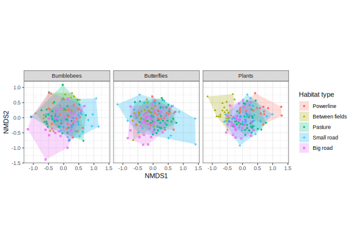
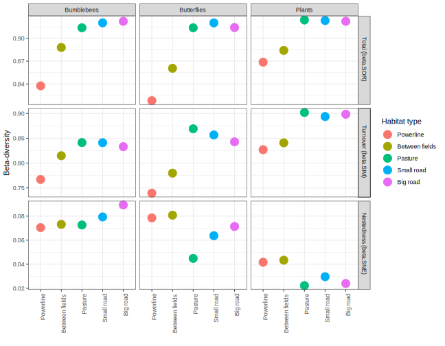
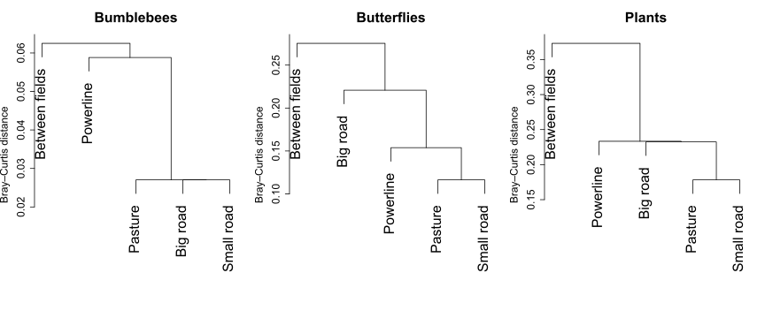

# greeninfra
Project about community (dis)similarity in Swedish green infrastructures

Comparison of bumblebee, butterfly and plant communities in different habitat types depending on the presence of green infrastructures (powerlines, roads) and on the amount of grassland in the surrounding landscape. 

### Preliminary results

Below is a plot of a Non-metric multidimensional scaling analysis (NMDS) showing differences in community composition between different habitats:

Beta-diversity appears consistently lower in powerline habitats and higher in road habitats and pastures, while beta-diversity is at an intermediate level in between-fields habitats.

Partitioning of beta-diversity reveals that patterns of beta-diversity are mostly driven by species turnover between habitat types.

Pairwise distance shows that between-fields habitats have the most unique species composition while pasture and small road habitats are consistently very similar.

