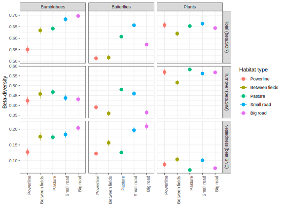
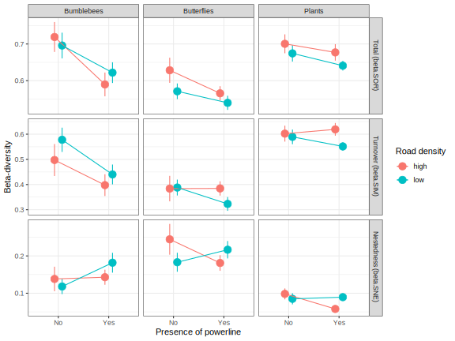
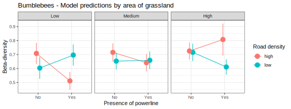
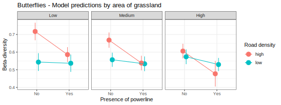

# greeninfra
Project about community (dis)similarity in Swedish green infrastructures

Comparison of bumblebee, butterfly and plant communities in different habitat types depending on the presence of green infrastructures (powerlines, roads) and on the amount of grassland in the surrounding landscape. 

## Methods

### Study design

Bumblebees, butterflies and plants sampled in 32 landscapes, with either high (16) or low (16) density of roads, and with (16) or without (16) powerlines.

In each of these landscapes, sampling took place in transects belonging to 4 or 5 habitat types : one grazed pasture, one large road, one small road, one field margin and one powerline corridor (in the 16 landscapes with powerlines).

### Analyses
Most of the results presented below are based on two types of measures:

- the calculation of the Shannon's diversity index in each transect 

- the calculation of pairwise community dissimilarity between all possible pairs of transects, expressed as 3 measures of beta-diversity: the total beta-diversity (beta.SOR) that is partitioned into its nestedness (beta.SNE) and turnover components (beta.SIM). These measures are then divided into:
  + pairwise dissimilarity between transects of the SAME habitat type
  + pairwise dissimilarity between transects of different habitat types within the SAME landscape

## Preliminary results

### Species diversity

Overall, there were differences in species diversity between taxa (*F*2,391 = 341.09, *P* < 0.001).
Specifically, the sampling plots had a higher species diversity of plants (mean Shannon index per transect = 2.62) than butterflies (mean Shannon index per transect = 1.64), and a higher species diversity of butterflies than bumblebees (mean Shannon index per transect = 1.09).

There were also differences in species diversity between the different habitat types for both plants and butterflies but not for bumblebees. Differences in diversity between habitats were largely consistent among taxa (even including bumblebees, for which it was not significant), the most diverse being powerline corridors, pastures and small roads, while field margins and big roads were less diverse.

The type of landscape did not influence the diversity of bumblebees and butterflies, but plant communities were more diverse in landscapes with the presence of a powerline.

*Effect of habitat type on Shannon diversity*

|               | Sum.Sq| Mean.Sq| NumDF|   DenDF| F value|    *P*|
|:--------------|------:|-------:|-----:|-------:|-------:|------:|
|**Bumblebee**  |  2.437|   0.609|     4| 102.189|   2.300|  0.064|
|**Butterflies**|  6.617|   1.654|     4| 101.478|   7.286|  <.001|
|**Plants**     |  5.092|   1.273|     4|  99.098|  15.732|  <.001|

*Effect of landscape type (powerline and road density) on Shannon diversity*

|                         |  Chisq| Df|        *P*|
|:------------------------|------:|--:|----------:|
|**Bumblebee**            |       |   |           |
|(Intercept)              | 58.943|  1|      <.001|
|Powerline                |  0.060|  1|      0.807|
|Road Density             |  0.001|  1|      0.978|
|Powerline:Road Density   |  0.609|  1|      0.435|
|**Butterflies**          |       |   |           |
|(Intercept)              |109.969|  1|      <.001|
|Powerline                |  1.089|  1|      0.297|
|Road Density             |  0.008|  1|      0.927|
|Powerline:Road Density   |  0.815|  1|      0.367|
|**Plants**               |       |   |           |
|(Intercept)              |307.989|  1|      <.001|
|Powerline                |  5.704|  1|      0.017|
|Road Density             |  2.927|  1|      0.087|
|Powerline:Road Density   |  1.848|  1|      0.174|

### Community composition

A Non-metric multidimensional scaling analysis (NMDS) reveals large overlap in community composition between different habitats or between landscape types. Specifically, a PERMANOVA analysis shows that habitat type accounts for 7.4% (*P* < 0.001), 10,4% (*P* < 0.001) and 17.2% (*P* < 0.001) of differences in community composition between transects for bumblebees, butterflies and plants respectively. Landscape type, specifically the interaction between the density of roads and the presence of powerlines, also had a small effect on community composition of butterflies (*P* = 0.04) and plants (*P* = 0.024), but not bumblebees (*P* = 0.803).

A visible effect is however that some habitat types are more variables than others. For example, for bumblebees, big road habitats appear more diverse (and slightly different in a few transects) than the others ; for butterflies, communities in small roads habitats seem to be more diverse than other habitat types while overlap all of them. For plants, between-fields habitats look highly different and only little overlapping compared to all other habitat types.

There is hardly any distinguishable difference between landscape types that can be inferred from a visual inspection of the NMDS. It is possible to see, however, that butterflies communities located in landscapes with no powerline but with a high density of roads have some extreme outliers that also correspond to small road habitats as described before.

<!--  When all sites belonging to a given habitat type were merged, a hierarchical cluster analysis on pairwise distances shows that between-fields habitats (field margins) have the most unique species composition while pasture and small road habitats are consistently very similar. Powerline habitats have also consistantly an intermediate composition between field margins and pasture/small roads, while big roads habitats have a species composition ressembling either small roads and pasture (bumblebees) or powerline (plants) habitats, or are more intermediate (butterflies).

--> 

### Effect of habitat type on beta-diversity

Community dissimilarity (i.e. beta-diversity) within habitats types clearly varied depending on the type of habitat and taxon. Roads and pastures appear to have constantly a larger beta-diversity than field margins. Powerline habitats, however, were the least diverse habitat for both bumblebees and butterflies, but not for plants. 

Partitioning of beta-diversity reveals that patterns of beta-diversity are mostly driven by species turnover between habitat types.

*Effect of habitat type on beta-diversity*

|                       | Sum.Sq| Mean.Sq| NumDF|   DenDF| F value|    *P*|
|:----------------------|------:|-------:|-----:|-------:|-------:|------:|
|**Bumblebee**          |       |        |      |        |        |       |
|Total (beta.SOR)       |  2.494|   0.623|     4|1779.450|  14.543|  <.001|
|Turnover (beta.SIM)    |  0.697|   0.174|     4|1787.555|   1.645|  0.160|
|Nestedness (beta.SNE)  |   0.63|   0.157|     4|1788.935|   3.913|  0.004|
|**Butterflies**        |       |        |      |        |        |       |
|Total (beta.SOR)       |  3.809|   0.952|     4|1778.857|  46.502|  <.001|
|Turnover (beta.SIM)    |  4.804|   1.201|     4|1789.126|  25.544|  <.001|
|Nestedness (beta.SNE)  |   2.31|   0.578|     4|1786.070|   19.38|  <.001|
|**Plants**             |       |        |      |        |        |       |
|Total (beta.SOR)       |  3.809|   0.952|     4|1778.857|  46.502|  <.001|
|Turnover (beta.SIM)    |  0.438|   0.109|     4|1764.918|   5.247|  <.001|
|Nestedness (beta.SNE)  |   0.22|   0.055|     4|1759.244|   4.609|  0.001|

### Effect of landscape type on beta-diversity

There is no effect of landscape features on the similarity of plant communities between habitat types within a landscape. 

The presence of powerlines contribute to larger similarity of bumblebee communities, especially in landscapes with high road density. Moreover, there is even evidence that this reduction of beta-diversity in bumblebee communities increases with decreasing area of grassland. In other words, the presence of powerline corridors improves the dispersion of bumblebees between habitats in landscapes that are otherwise highly disturbed (few grasslands and lots of roads). 

Powerlines did not significantly influence the similarity of butterfly communities after controling for other factors. However, beta-diversity was higher in landscapes with high road density. i.e. roads may act as a barrier to dispersal of butterflies between different habitats. This is especially true when the amount of grassland in the landscape is low, as evidenced by a significant interaction with grassland area.

*Effect of landscape type (powerline and road density) and grassland area on beta-diversity between habitats within landscape*

|                                  |  Chisq| Df|        *P*|
|:---------------------------------|------:|--:|----------:|
|**Bumblebee**                     |       |   |           |
|*Total (beta.SOR)*                |       |   |           |
|(Intercept)                       | 55.856|  1|      <.001|
|Powerline                         |  5.631|  1|      0.018|
|Road Density                      |  1.183|  1|      0.277|
|Grasslands                        |  0.113|  1|      0.737|
|Powerline:Road Density            |  7.006|  1|      0.008|
|Powerline:Grasslands              |  4.002|  1|      0.045|
|Road Density:Grasslands           |  1.039|  1|      0.308|
|Powerline:Road Density:Grasslands |  8.117|  1|      0.004|
|*Turnover (beta.SIM)*             |       |   |           |
|(Intercept)                       | 18.643|  1|      <.001|
|Powerline                         |  2.239|  1|      0.135|
|Road Density                      |  0.557|  1|      0.456|
|Grasslands                        |  0.020|  1|      0.888|
|Powerline:Road Density            |  3.489|  1|      0.062|
|Powerline:Grasslands              |  1.000|  1|      0.317|
|Road Density:Grasslands           |  1.610|  1|      0.205|
|Powerline:Road Density:Grasslands |  4.004|  1|      0.045|
|*Nestedness (beta.SNE)*           |       |   |           |
|(Intercept)                       | 59.619|  1|      <.001|
|Powerline                         |  3.439|  1|      0.064|
|Road Density                      |  0.373|  1|      0.541|
|Grasslands                        |  <.001|  1|      0.989|
|Powerline:Road Density            |  2.628|  1|      0.105|
|Powerline:Grasslands              |  4.250|  1|      0.039|
|Road Density:Grasslands           |  0.671|  1|      0.413|
|Powerline:Road Density:Grasslands |  5.773|  1|      0.016|
|**Butterflies**                   |       |   |           |
|*Total (beta.SOR)*                |       |   |           |
|(Intercept)                       |163.164|  1|      <.001|
|Powerline                         |  2.193|  1|      0.139|
|Road Density                      |  7.832|  1|      0.005|
|Grasslands                        | 12.098|  1|      0.001|
|Powerline:Road Density            |  1.337|  1|      0.248|
|Powerline:Grasslands              |  0.001|  1|      0.975|
|Road Density:Grasslands           |  5.887|  1|      0.015|
|Powerline:Road Density:Grasslands |  0.147|  1|      0.701|
|*Turnover (beta.SIM)*             |       |   |           |
|(Intercept)                       | 31.055|  1|      <.001|
|Powerline                         |  0.400|  1|      0.527|
|Road Density                      |  0.022|  1|      0.883|
|Grasslands                        |  1.993|  1|      0.158|
|Powerline:Road Density            |  0.150|  1|      0.698|
|Powerline:Grasslands              |  0.248|  1|      0.618|
|Road Density:Grasslands           |  0.078|  1|      0.779|
|Powerline:Road Density:Grasslands |  0.015|  1|      0.901|
|*Nestedness (beta.SNE)*           |       |   |           |
|(Intercept)                       | 31.383|  1|      <.001|
|Powerline                         |  0.019|  1|      0.890|
|Road Density                      |  4.321|  1|      0.038|
|Grasslands                        |  0.419|  1|      0.517|
|Powerline:Road Density            |  1.072|  1|      0.301|
|Powerline:Grasslands              |  1.203|  1|      0.273|
|Road Density:Grasslands           |  3.490|  1|      0.062|
|Powerline:Road Density:Grasslands |  0.001|  1|      0.980|
|**Plants**                        |       |   |           |
|*Total (beta.SOR)*                |       |   |           |
|(Intercept)                       |134.212|  1|      <.001|
|Powerline                         |  1.819|  1|      0.177|
|Road Density                      |  0.909|  1|      0.340|
|Grasslands                        |  1.768|  1|      0.184|
|Powerline:Road Density            |  0.280|  1|      0.597|
|Powerline:Grasslands              |  0.315|  1|      0.575|
|Road Density:Grasslands           |  0.080|  1|      0.777|
|Powerline:Road Density:Grasslands |  0.112|  1|      0.738|
|*Turnover (beta.SIM)*             |       |   |           |
|(Intercept)                       | 89.148|  1|      <.001|
|Powerline                         |  0.917|  1|      0.338|
|Road Density                      |  0.682|  1|      0.409|
|Grasslands                        |  2.535|  1|      0.111|
|Powerline:Road Density            |  0.123|  1|      0.726|
|Powerline:Grasslands              |  0.423|  1|      0.516|
|Road Density:Grasslands           |  0.281|  1|      0.596|
|Powerline:Road Density:Grasslands |  0.256|  1|      0.613|
|*Nestedness (beta.SNE)*           |       |   |           |
|(Intercept)                       |188.345|  1|      <.001|
|Powerline                         |  0.123|  1|      0.725|
|Road Density                      |  0.009|  1|      0.923|
|Grasslands                        |  1.905|  1|      0.167|
|Powerline:Road Density            |  0.237|  1|      0.626|
|Powerline:Grasslands              |  0.174|  1|      0.677|
|Road Density:Grasslands           |  0.296|  1|      0.586|
|Powerline:Road Density:Grasslands |  0.179|  1|      0.672|
