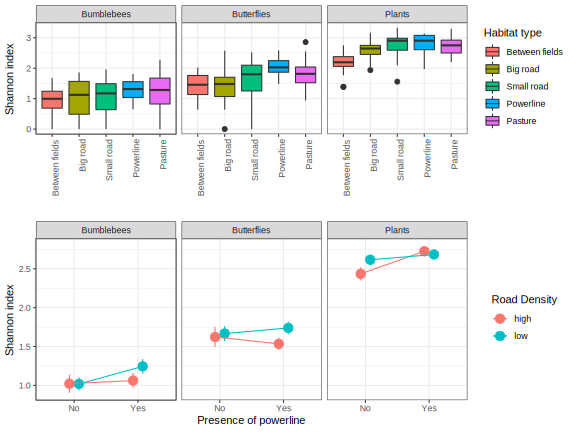

# greeninfra
Project about community (dis)similarity in Swedish green infrastructures

Comparison of bumblebee, butterfly and plant communities in different habitat types depending on the presence of green infrastructures (powerlines, roads) and on the amount of grassland in the surrounding landscape. 

## Preliminary results

### Species diversity

Overall, there were differences in species diversity between taxa, both in terms of raw species richness (*F*2,391 = 303.83, *P* < 0.001) and using the Shannon index of diversity (*F*2,391 = 341.09, *P* < 0.001).

Specifically, the sampling plots had a higher species diversity of plants (mean species richness per transect = 16.7, mean Shannon index per transect = 2.62) than butterflies (mean species richness per transect = 8.65, mean Shannon index per transect = 1.64), and a higher species diversity of butterflies than bumblebees (mean species richness per transect = 4.22, mean Shannon index per transect = 1.09).

There were differences in species diversity (expressed as Shannon index) between the different habitat types for both plants (*F*4,127 = 11.79, *P* < 0.001) and butterflies (*F*4,128 = 6.45, *P* < 0.001) but not for bumblebees (*F*4,128 = 2.01, *P* = 0.097).

Differences in diversity were largely consistent between taxa (even including bumblebees, for which it was not significant), the most diverse being pastures, powerlines and small roads, while field margins and big roads were less diverse.

### Community composition

When all sites belonging to a given habitat type were merged, a hierarchical cluster analysis on pairwise distances shows that between-fields habitats (field margins) have the most unique species composition while pasture and small road habitats are consistently very similar. Powerline habitats have also consistantly an intermediate composition between field margins and pasture/small roads, while big roads habitats have a species composition ressembling either small roads and pasture (bumblebees) or powerline (plants) habitats, or are more intermediate (butterflies).

A Non-metric multidimensional scaling analysis (NMDS) reveals large overlap in community composition between different habitats, but also shows that some habitat types are more variables than others. For example, big road habitats appear more divergent and more diverse than the others for bumblebees; for butterflies, communities in small roads habitats seem to overlap all other habitat types; for plantes, between-fields habitats look highly different and only little overlapping comapred to all other habitat types.

Better insights into differences in community composition that can exist within the same habitat types can be gained from analyses of community dissimilarity among transects of the same habitat type, a.k.a. beta-diversity. Here, beta-diversity appears consistently lower in powerline habitats (i.e. homogeneous community compositon) and higher in road habitats and pastures, while beta-diversity is at an intermediate level in between-fields habitats (field margins).  

Partitioning of beta-diversity reveals that patterns of beta-diversity are mostly driven by species turnover between habitat types.

### Influence of powerlines and road density 

