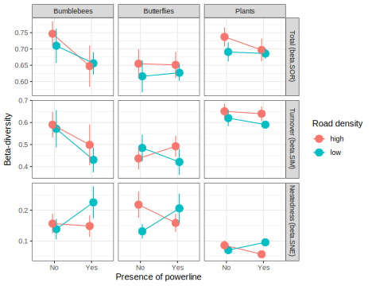

# greeninfra
Project about community (dis)similarity in Swedish green infrastructures

Comparison of bumblebee, butterfly and plant communities in different habitat types depending on the presence of green infrastructures (powerlines, roads) and on the amount of grassland in the surrounding landscape. 

## Preliminary results

### Differences in community composition between habitat types

Below is a plot of a Non-metric multidimensional scaling analysis (NMDS) showing the overlap / differences in community composition between different habitats:

Beta-diversity appears consistently lower in powerline habitats and higher in road habitats and pastures, while beta-diversity is at an intermediate level in between-fields habitats (field margins).

Partitioning of beta-diversity reveals that patterns of beta-diversity are mostly driven by species turnover between habitat types.

Pairwise distances show that between-fields habitats have the most unique species composition while pasture and small road habitats are consistently very similar.

### Influence of powerlines and road density on beta-diversity between habitat types 

Differences in community composition between habitats (beta-diversity) appear to be influenced by both the presence of powerlines and the density of roads in the landscape.

Interestingly, the pattern is consistent across the three taxa sampled: 

* In landscapes of **high** road density, beta-diversity is increased with the presence of powerlines, i.e. habitats are composed of more different species compared to landscapes with no powerlines
* In landscapes of **low** road density, beta-diversity is decreased with the presence of powerlines, i.e. habitats are composed of more similar species compared to landscapes with no powerlines

This is confirm by the significant interaction between **powerline** presence and **road density** in a linear model with between-habitat beta-diversity as explanatory variable.

-----------------------------------------------------------------------------
        &nbsp;                  Estimate   Std. Error   t value   Pr(>|t|)  
------------------------------- ---------- ------------ --------- -----------
**(Intercept)**                 0.3529     0.02014      17.53     **2.213e-06** 

**Powerline [Yes]**             0.0441     0.02325      1.897     0.1067   

**Road Density [Low]**          0.04295    0.02325      1.847     0.1142   

**taxon [Butterflies]**         0.1039     0.02014      5.158     **0.002098**  

**taxon [Plants]**              0.1885     0.02014      9.36      **8.434e-05** 

**Powerline x Road density**    -0.123     0.03288      -3.74     **0.009621**  
                                                        
-----------------------------------------------------------------------------

--------------------------------------------------------------
 Observations   Residual Std. Error   $R^2$    Adjusted $R^2$ 
-------------- --------------------- -------- ----------------
      12              0.02848         0.9456       0.9003     
--------------------------------------------------------------

Table: Fitting linear model: beta.SOR ~ Powerline * Road Density + taxon
