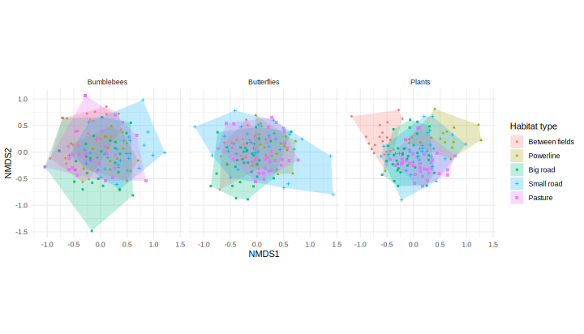

# greeninfra
Project about community (dis)similarity in Swedish green infrastructures

Comparison of bumblebee, butterfly and plant communities in different habitat types, including road verges and powerline corridors.

## Methods

### Study design

Bumblebees, butterflies and plants sampled in 32 landscapes, with either high (16) or low (16) density of roads, and with (16) or without (16) powerlines.

In each of these landscapes, sampling took place in transects belonging to 4 or 5 habitat types : one grazed pasture, one large road, one small road, one field margin and one powerline corridor (in the 16 landscapes with powerlines).

### Analyses
In the results presented below, the diversity of communities if decomposed into:

- *Gamma diversity*: the total, summed, diversity per habitat or landscape type

- *Alpha diversity*: the diversity observed within each each transect

Gamma and alpha diversity are expressed as the species richness (i.e. no. of species) or the Shannon diversity index which incorportates the relative abundance of each species (thus represents both species richness and evenness).

- *Beta diversity*: the difference in community composition among transects of the same habitat type, or among all transects within the same landscape. Beta-diversity is expressed as the total beta-diversity (beta.SOR) that is partitioned into its nestedness (beta.SNE) and turnover components (beta.SIM). 

### Analyses at the scale of habitat types

#### Gamma diversity

Here it does not make much sense to compare total diversity in powerline habitats with the other habitat types, since they are present only in landscape with powerlines, by definition

*Total species richness per habitat type, for each taxon*:

|taxon       | Between fields| Big road| Pasture| Powerline| Small road|
|:-----------|--------------:|--------:|-------:|---------:|----------:|
|Bumblebees  |             16|       18|      18|        16|         17|
|Butterflies |             26|       34|      43|        35|         43|
|Plants      |             49|       85|     102|        79|        100|

*Total Shannon diversity per habitat type, for each taxon*:

|Taxon       | Between fields| Big road| Pasture| Powerline| Small road|
|:-----------|--------------:|--------:|-------:|---------:|----------:|
|Bumblebees  |           3.77|     4.29|    4.55|      3.81|       4.46|
|Butterflies |           4.47|     4.86|    5.25|      4.78|       4.95|
|Plants      |           5.20|     6.10|    6.22|      5.60|       6.28|

#### Alpha diversity

Note: in the results below, what is presented as "ANOVA" is actually computed as linear mixed models with the identity of the landscape as random intercept. 

*Mean species richness (and standard deviation) per habitat type, for each taxon*: 

|Taxon       |Habitat type   | Mean  |   SD|
|:-----------|:--------------|------:|----:|
|Bumblebees                                |
|            |Between fields |   3.38| 1.63|
|            |Big road       |   4.03| 2.50|
|            |Pasture        |   4.84| 2.57|
|            |Powerline      |   4.62| 1.54|
|            |Small road     |   4.35| 2.54|
|Butterflies                               |
|            |Between fields |   7.05| 2.64|
|            |Big road       |   6.34| 3.48|
|            |Pasture        |  10.16| 4.16|
|            |Powerline      |  12.69| 3.94|
|            |Small road     |   8.47| 4.45|
|Plants                                    |
|            |Between fields |  10.30| 3.39|
|            |Big road       |  15.97| 4.64|
|            |Pasture        |  17.94| 4.83|
|            |Powerline      |  19.06| 5.94|
|            |Small road     |  18.84| 6.48|

ANOVA to test whether species richness significantly differs between habitat types:

|Taxon      |  Sum Sq| Mean Sq| NumDF|  DenDF| F value| Pr(>F)|
|:----------|-------:|-------:|-----:|------:|-------:|------:|
|Bumblebees                                                   |
|           |   30.80|    7.70|     4| 100.49|    1.69|   0.16|
|Butterflies                                                  |   
|           |  555.13|  138.78|     4| 102.83|   10.61|   0.00|
|Plants                                                       |
|           | 1004.03|  251.01|     4|  99.03|   14.02|   0.00|

There is clearly a difference between habitat types in terms of species richness for butterflies and plants, but not for bumblebees.

Because there may be additional factors that influence species richness with transects, the analysis is now run with additional variables: the proportion of open land in the landscape (because we analyse grassland habitats), the diversity of the landscape (expressed as the Shannon diversity index calculated with the proportion of each of land cover types within the landscape), the presence or not of powerlines, the density of roads (low vs. high) and the interaction between the latter.

|Taxon       |Variables               | Chisq| Df| Pr(>Chisq)|
|:-----------|:-----------------------|-----:|--:|----------:|
|Bumblebees                               					         |
|            |Habitat type            |  6.73|  4|       0.15|
|            |Prop. open area         |  0.00|  1|       0.98|
|            |Land. diversity         |  0.00|  1|       0.95|
|            |Powerline               |  0.02|  1|       0.90|
|            |Road density            |  1.12|  1|       0.29|
|            |Powerline x Road density|  0.12|  1|       0.73|
|Butterflies                                                 |
|            |Habitat type            | 40.31|  4|       0.00|
|            |Prop. open area         |  1.76|  1|       0.18|
|            |Land. diversity         |  0.18|  1|       0.67|
|            |Powerline               |  1.24|  1|       0.27|
|            |Road density            |  0.38|  1|       0.54|
|            |Powerline x Road density|  3.24|  1|       0.07|
|Plants                                                      |                          
|            |Habitat type            | 55.04|  4|       0.00|
|            |Prop. open area         |  0.14|  1|       0.71|
|            |Land. diversity         |  0.18|  1|       0.67|
|            |Powerline               |  1.84|  1|       0.17|
|            |Road density            |  0.00|  1|       0.97|
|            |Powerline x Road density|  0.01|  1|       0.92|

The previous results remain the same; there no additional effect of any of the other variables.

*Mean Shannon diversity (and standard deviation) per habitat type, for each taxon*: 

|Taxon       |Habitat type   | Mean  |   SD|
|:-----------|:--------------|------:|----:|
|Bumblebees                                |
|            |Between fields |   0.96| 0.48|
|            |Big road       |   1.00| 0.63|
|            |Pasture        |   1.27| 0.52|
|            |Powerline      |   1.27| 0.36|
|            |Small road     |   1.08| 0.57|
|Butterflies                           	   |
|            |Between fields |   1.46| 0.41|
|            |Big road       |   1.38| 0.51|
|            |Pasture        |   1.85| 0.43|
|            |Powerline      |   2.03| 0.32|
|            |Small road     |   1.62| 0.68|
|Plants                                    |
|            |Between fields |   2.16| 0.35|
|            |Big road       |   2.61| 0.30|
|            |Pasture        |   2.73| 0.28|
|            |Powerline      |   2.77| 0.37|
|            |Small road     |   2.75| 0.42|

ANOVA to test whether Shannon diversity significantly differs between habitat types:

|Taxon      |  Sum Sq| Mean Sq| NumDF|  DenDF| F value| Pr(>F)|
|:----------|-------:|-------:|-----:|------:|-------:|------:|
|Bumblebees                                                   |
|           |    2.08|    0.52|     4| 100.87|    2.07|   0.09|
|Butterflies                                                  |
|           |    6.65|    1.66|     4| 101.48|    7.31|   0.00|
|Plants                                                       |       
|           |    5.08|    1.27|     4|  99.12|   15.74|   0.00|

Same as species richness: there is clearly a difference between habitat types in terms of Shannon diversity for butterflies and plants, but not for bumblebees.

Because there may be additional factors that influence Shannon diversity richness, the analysis is now run with additional variables: the proportion of open land in the landscape (because we analyse grassland habitats), the diversity of the landscape (expressed as the Shannon diversity index calculated with the proportion of each of land cover types within the landscape), the presence or not of powerlines, the density of roads (low vs. high) and the interaction between the latter.

|Taxon       |Variables               | Chisq| Df| Pr(>Chisq)|
|:-----------|:-----------------------|-----:|--:|----------:|
|Bumblebees                               			        		 |
|            |Habitat type            |  8.33|  4|       0.08|
|            |Prop. open area         |  0.07|  1|       0.78|
|            |Land. diversity         |  0.26|  1|       0.61|
|            |Powerline               |  0.04|  1|       0.85|
|            |Road density            |  1.41|  1|       0.23|
|            |Powerline x Road density|  0.16|  1|       0.69|
|Butterflies                          					             | 
|            |Habitat type            | 28.08|  4|       0.00|
|            |Prop. open area         |  0.66|  1|       0.42|
|            |Land. diversity         |  0.62|  1|       0.43|
|            |Powerline               |  1.96|  1|       0.16|
|            |Road density            |  1.81|  1|       0.18|
|            |Powerline x Road density|  3.60|  1|       0.06|
|Plants                               				        	     |
|            |Habitat type            | 61.53|  4|       0.00|
|            |Prop. open area         |  0.08|  1|       0.78|
|            |Land. diversity         |  0.05|  1|       0.83|
|            |Powerline               |  1.75|  1|       0.19|
|            |Road density            |  0.03|  1|       0.86|
|            |Powerline x Road density|  0.00|  1|       0.99|

As for species richness, the results remain the same; there no additional effect of any of the other variables.

#### Beta-diversity

First, the differences in community composition between habitat types can be assessed visually by plotting the results of a non-metric multidimensional scaling:  

Another way to visualise differences in community composition between habitat type is to do a clustering analysis (based here on Bray-Curtis distance):

These plots can be improved by a complementary analysis (a PERMANOVA) to test whether community composition significantly differs between habitat types (note that we add landscape identity as an additional variable to account for the fact that several transects were sampled per landscape). This also allows to decompose the variance explained by different factors.

|Taxon       |Variables     |  Df| SumsOfSqs| MeanSqs| F.Model|   R2| Pr(>F)|
|:-----------|:-------------|---:|---------:|-------:|-------:|----:|------:|
|Bumblebees                                                                 |
|            |Habitat  type |   4|      3.16|    0.79|    2.55| 0.07|   0.00|
|            |Landscape     |   1|      0.38|    0.38|    1.21| 0.01|   0.27|
|            |Residuals     | 125|     38.80|    0.31|        | 0.92|       |
|            |Total         | 130|     42.34|        |        | 1.00|       |
|Butterflies                          					    		                 		| 
|            |Habitat  type |   4|      3.30|    0.82|    3.74| 0.10|   0.00|
|            |Landscape     |   1|      0.63|    0.63|    2.85| 0.02|   0.00|
|            |Residuals     | 127|     28.00|    0.22|        | 0.88|       |
|            |Total         | 132|     31.93|        |        | 1.00|       |
|Plants                               								                	    |
|            |Habitat  type |   4|      6.74|    1.69|    6.80| 0.18|   0.00|
|            |Landscape     |   1|      0.51|    0.51|    2.05| 0.01|   0.01|
|            |Residuals     | 126|     31.23|    0.25|        | 0.81|       |
|            |Total         | 131|     38.49|        |        | 1.00|       |

There is with no doubt significant differences in community composition between habitat types, for all taxa.

As for analyses of alpha diversity, the analysis is now run with additional variables: the proportion of open land in the landscape (because we analyse grassland habitats), the diversity of the landscape (expressed as the Shannon diversity index calculated with the proportion of each of land cover types within the landscape), the presence or not of powerlines, the density of roads (low vs. high) and the interaction between the latter.

|Taxon       |Variables               |  Df| SumsOfSqs| MeanSqs| F.Model|   R2| Pr(>F)|
|:-----------|:-----------------------|---:|---------:|-------:|-------:|----:|------:|
|Bumblebees                           							                              	  |
|            |Landscape	              |   1|      0.40|    0.40|    1.30| 0.01|   0.22|
|            |Habitat type            |   4|      3.14|    0.79|    2.56| 0.07|   0.00|
|            |Prop. open area         |   1|      0.36|    0.36|    1.17| 0.01|   0.30|
|            |Land. diversity         |   1|      0.36|    0.36|    1.18| 0.01|   0.29|
|            |Powerline               |   1|      0.70|    0.70|    2.27| 0.02|   0.01|
|            |Road density            |   1|      0.39|    0.39|    1.26| 0.01|   0.23|
|            |Powerline x Road density|   1|      0.17|    0.17|    0.57| 0.00|   0.86|
|            |Residuals				        | 120|     36.82|    0.31|        | 0.87|       |
|            |Total					          | 130|     42.34|        |        | 1.00|       |
|Butterflies                                                   										    | 
|            |Landscape	              |   1|      0.62|    0.62|    2.84| 0.02|   0.00|
|            |Habitat type            |   4|      3.30|    0.83|    3.78| 0.10|   0.00|
|            |Prop. open area         |   1|      0.24|    0.24|    1.11| 0.01|   0.34|
|            |Land. diversity         |   1|      0.37|    0.37|    1.72| 0.01|   0.06|
|            |Powerline               |   1|      0.31|    0.31|    1.42| 0.01|   0.14|
|            |Road density            |   1|      0.21|    0.21|    0.96| 0.01|   0.48|
|            |Powerline x Road density|   1|      0.21|    0.21|    0.98| 0.01|   0.46|
|            |Residuals				        | 122|     26.65|    0.22|        | 0.83|       |
|            |Total					          | 132|     31.93|        |        | 1.00|       |
|Plants                                                       										    |
|            |Landscape	              |   1|      0.61|    0.61|    2.45| 0.02|   0.00|
|            |Habitat type            |   4|      6.65|    1.66|    6.74| 0.17|   0.00|
|            |Prop. open area         |   1|      0.38|    0.38|    1.52| 0.01|   0.07|
|            |Land. diversity         |   1|      0.20|    0.20|    0.81| 0.01|   0.69|
|            |Powerline               |   1|      0.29|    0.29|    1.18| 0.01|   0.25|
|            |Road density            |   1|      0.29|    0.29|    1.19| 0.01|   0.24|
|            |Powerline x Road density|   1|      0.22|    0.22|    0.90| 0.01|   0.56|
|            |Residuals				        | 121|     29.85|    0.25|        | 0.78|       |
|            |Total					          | 131|     38.49|        |        | 1.00|       |

We only observe, in addition to differences in community composition between habitat types (for all taxa) and between the different landscapes (for butterlfies and plants), a significant difference of bumblebee communities depending on the presence of powerlines in the landscape.

Now, beta-diversity is computed among transects of similar habitat types, and decomposed into total, turnover and nestedness beta-diversity.

For all taxa, communities in powerline corridors and between field margins are more similar to each others (lower beta-diversity) than in the other habitat types. 

### Analyses at the scale of landscape types

Most of the analyses presented above may be repeated at the scale of landscape types (characterised by the presence/absence of powerlines and road density); this is possibly what has already been done in the SciRep paper.

#### Gamma diversity

*Total species richness per landscape type, for each taxon*:

|taxon       | No powerline / High road density| Powerline / High road density| No powerline / Low road density| Powerline / Low road density|
|:-----------|--------------------------------:|-----------------------------:|-------------------------------:|----------------------------:|
|Bumblebees  |                               18|                            18|                              16|                           16|
|Butterflies |                               37|                            34|                              42|                           41|
|Plants      |                               91|                           105|                              88|                           98|

*Total Shannon diversity per landscape type, for each taxon*:

|taxon       | No powerline / High road density| Powerline / High road density| No powerline / Low road density| Powerline / Low road density|
|:-----------|--------------------------------:|-----------------------------:|-------------------------------:|----------------------------:|
|Bumblebees  |                             4.10|                          4.44|                            4.29|                         4.59|
|Butterflies |                             5.01|                          4.80|                            4.78|                         5.10|
|Plants      |                             5.91|                          6.09|                            5.95|                         6.14|

#### Alpha diversity

*Mean species richness (and standard deviation) per landscape type, for each taxon*: 

|Taxon       |Powerline |Road density | Mean  |   SD|
|:-----------|:---------|:------------|------:|----:|
|Bumblebees                          		            |
|            |No        |High         |   8.62| 2.62|
|            |No        |Low          |   9.12| 2.90|
|            |Yes       |High         |   9.00| 3.16|
|            |Yes       |Low          |   9.75| 2.38|
|Butterflies                 		                    |
|            |No        |High         |  17.12| 3.00|
|            |No        |Low          |  18.75| 4.95|
|            |Yes       |High         |  14.38| 5.80|
|            |Yes       |Low          |  19.12| 6.45|
|Plants   		                                      |
|            |No        |High         |  35.00| 9.15|
|            |No        |Low          |  34.38| 5.66|
|            |Yes       |High         |  43.12| 7.14|
|            |Yes       |Low          |  40.25| 6.20|

*Mean Shannon diversity (and standard deviation) per landscape type, for each taxon*: 

|Taxon       |Powerline |Road density | Mean  |   SD|
|:-----------|:---------|:------------|------:|----:|
|Bumblebees                          		            |
|            |No        |High         |   2.13| 0.44|
|            |No        |Low          |   2.35| 0.37|
|            |Yes       |High         |   2.32| 0.38|
|            |Yes       |Low          |   2.50| 0.33|
|Butterflies   		                                  |
|            |No        |High         |   2.95| 0.25|
|            |No        |Low          |   2.85| 0.44|
|            |Yes       |High         |   2.68| 0.47|
|            |Yes       |Low          |   2.99| 0.43|
|Plants   		                                      | 
|            |No        |High         |   3.80| 0.29|
|            |No        |Low          |   3.85| 0.21|
|            |Yes       |High         |   4.00| 0.20|
|            |Yes       |Low          |   4.04| 0.24|

#### Beta-diversity

Non-metric multidimensional scaling:  

Cluster analysis:

Beta diversity:

